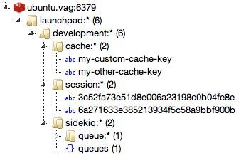

Rails
=====

This page contains Rails specific tips and recommendations. See also [useful gems](rails-gems.md)

## Every app should

* Put the ruby version it uses in the README.md file
* [Use service objects for decomposing application](http://blog.codeclimate.com/blog/2012/10/17/7-ways-to-decompose-fat-activerecord-models/)
  Try not to use for example observers or filters.
* Group gems in [meaningful groups](https://gist.github.com/teamon/69a31a132ce18825f003) (not alphabetically).
* Use Coffeescript instead of plain JavaScript.
* When making time-based statistic use the midnight of next day as upper limit
* Split upload path into subdirectories
```ruby
# partition_uid("1234567890")
# => "123/456/789/0"
def partition_uid(uid, size)
    uid.gsub(/(.{#{size}})/, "\\1/")
end
```

* If converting images, optimize them for web. imagemagick options: `-strip +profile "exif" -quality 80`
* If using whenever, set absolute paths
```ruby
set :output, File.join("log", "cron.log")
job_type :rake, "cd :path && RAILS_ENV=:environment /usr/local/bin/bundle exec rake :task :output"
```

* In non-SPA applications render URLs for JavaScript on server side. If you need to add them to custom JavaScript component, just print the links and iterate through them:
  ```
  $('a').each(function(index, el) { carousel.add(index, el); });
  ```
* Use I18n keys instead of plain text in views. In order to keep the reusability, the translation strings shouldn’t contain punctuation at their end, because those belong to the very UI.
* Use attr_accessible instead of attr_protected
* Occasionally run `rails_best_practices` command, and follow the hints.
* If using `strong_parameters` gem, turn `whitelist_attributes` off, otherwise leave it enabled.

## Setup generators
```ruby
# config/application.rb
config.generators do |g|
  g.helper      false
  g.stylesheets false
  g.javascripts false
end
```

## Remember to add indexes for foreign keys

```ruby
class CreateComments < ActiveRecord::Migration
  def change
    create_table :comments do |t|
      t.integer :post_id
      t.integer :user_id

      # ...
    end

    add_index :comments, :post_id # <= this
    add_index :comments, :user_id # <= and this
  end
end
```

## Required gems for new apps

```ruby
gem 'strong_parameters'
gem 'slim-rails'
gem 'sidekiq'
gem 'devise-async'
gem 'decent_exposure'
gem 'letter_opener'
gem 'schema_plus'
gem 'coffee-rails-source-maps'

group :development do
  gem 'letter_opener'
  gem 'rails_best_practices'
end
```

## Setup proper redis namespaces



### Rails cache store

```ruby
# config/application.rb
config.cache_store = :redis_store, "redis://localhost:6379/0/app_name:#{Rails.env}:cache"
```


### Rails session store

```ruby
# config/initializers/session_store.rb
Rails.application.config.session_store :redis_store, :redis_server => { :namespace => "app_name:#{Rails.env}:session" }
```


### Rack cache

```ruby
# config/environments/production.rb
config.action_dispatch.rack_cache = {
  :metastore    => "redis://localhost:6379/0/app_name:#{Rails.env}:rack-cache:metastore",
  :entitystore  => "redis://localhost:6379/0/app_name:#{Rails.env}:rack-cache:entitystore"
}
```

### Sidekiq

```ruby
# config/initializers/sidekiq.rb
Sidekiq.configure_server do |config|
  config.redis = { :namespace => "app_name:#{Rails.env}:sidekiq" }
end

Sidekiq.configure_client do |config|
  config.redis = { :namespace => "app_name:#{Rails.env}:sidekiq" }
end
```

### Faye server

```ruby
# faye.ru
faye_server = Faye::RackAdapter.new(
  :mount => '/faye',
  :timeout => 30,
  :engine => {
    :type  => Faye::Redis, # or Faye::PersistentRedis
    :namespace => "app_name:#{ENV["RACK_ENV"]}:faye:"
  }
)
```

### Source maps

```ruby
# Do not compress assets
config.assets.compress = false

# Expands the lines which load the assets
config.assets.debug = true

# Enable sources maps
config.sass.debug_info = true
config.sass.line_comments = false
```
